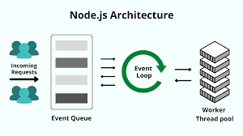

# NodeJS Basics
This repository contains a series of tasks designed to help master the fundamentals of NodeJS, back-end development, and working with ExpressJS. 

## Overview
This project actually consists of a series of tasks covering various aspects of NodeJS development, including executing basic JavaScript, working with files synchronously and asynchronously, creating HTTP servers using Node's HTTP module and Express, and organizing a complex HTTP server using Express. Each task is designed to build upon the previous one, gradually increasing in complexity.

## Learning objectives
By handling the entire project, one should be able to:
- Run JavaScript using NodeJS
- Utilize NodeJS modules effectively
- Read and manipulate files synchronously and asynchronously
- Access command line arguments and environment variables using the Process API
- Create HTTP servers using NodeJS and ExpressJS
- Implement advanced routes with ExpressJS
- Utilize ES6 features with NodeJS, including Babel-node
- Develop faster using Nodemon

## Provided files
- `database.csv`: A CSV file containing student data
- `package.json`: Dependency configuration file
- `babel.config.js`: Babel configuration file
- `.eslintrc.js`: ESLint configuration file
